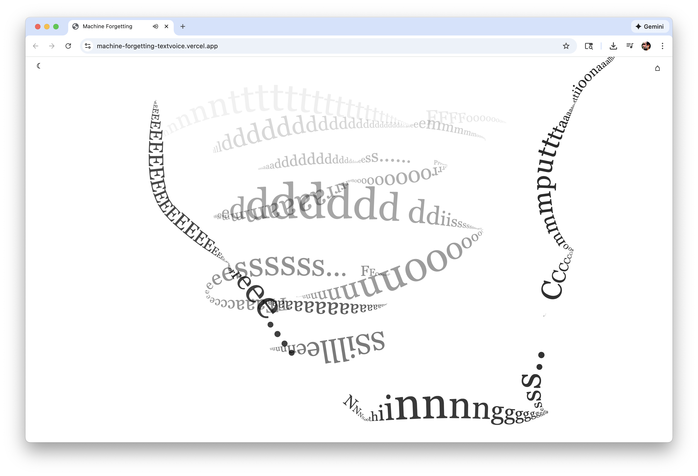
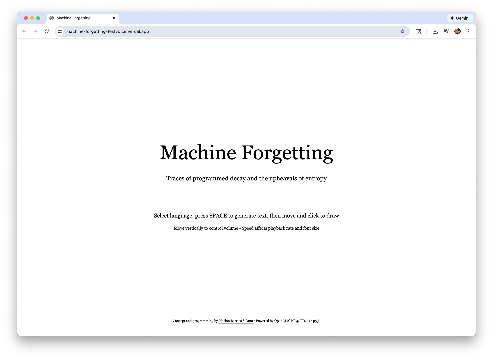
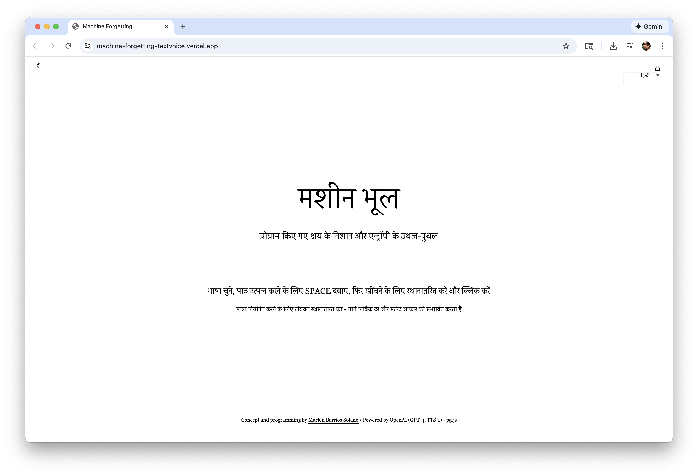
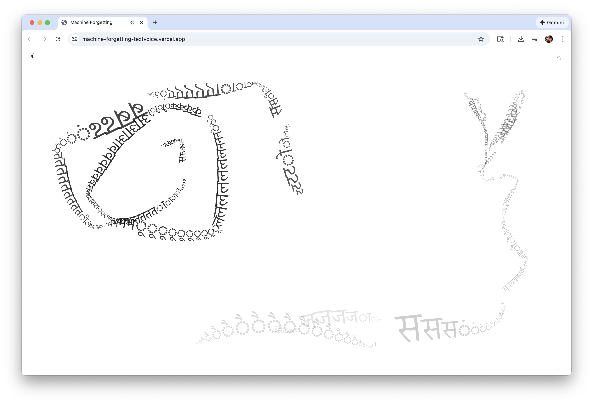

# Machine Forgetting

**Traces of programmed decay and the upheavals of entropy**



[🌐 **Live App** →](https://machine-forgetting-textvoice.vercel.app/)



An interactive drawing application exploring the poetics of computational forgetting, autoregressive processes, and the necessity of forgetting in machine learning systems. The work embodies its own subject matter: form emerges through drawing, grows with gesture, decays as letters fade, and dissipates into nothingness. Draw with AI-generated text that fades over time, creating ephemeral traces of language and memory.

Powered by OpenAI (GPT-4, TTS-1) and p5.js.

Concept and programming by [Marlon Barrios Solano](https://marlonbarrios.github.io/)

## 🌐 Live App

**Experience the installation:** [https://machine-forgetting-textvoice.vercel.app/](https://machine-forgetting-textvoice.vercel.app/)

The live application is hosted on Vercel and ready to use. Simply visit the link above to start exploring computational forgetting through interactive drawing with AI-generated text.

## Concept

**Machine Forgetting** is an interactive installation that explores forgetting as a computational necessity. The work generates texts sparse, minimal, repetitive, existential—about computational forgetting, context windows, autoregressive sequences, token limits, memory constraints, and preprogrammed dissipation.

The work itself embodies the processes it describes: form emerges through drawing, grows with gesture and speed, decays as letters fade over time, and dissipates into nothingness. Each trace is temporary, each mark destined to disappear, mirroring the computational forgetting it contemplates.

Users draw by clicking and dragging, which plays the generated text as speech while rendering letters that fade over time. The text drawing is synchronized with audio playback—each character appears exactly when it's spoken. The drawing speed affects both font size and audio playback rate, creating a dynamic relationship between gesture, sound, and visual trace. When the mouse accelerates, letters repeat and stretch, simulating time dilation—a visual metaphor for the stretching of computational time. Audio only plays when actively clicking and dragging; it pauses smoothly when movement stops (with fade-out to prevent audio artifacts). Letters disappear after 15 seconds, leaving only ephemeral marks of what was once there.

## Features

### Multi-Language Support
- **30 Languages Available**: English, Spanish, French, German, Chinese, Japanese, Arabic, Portuguese, Russian, Hindi, Italian, Korean, Turkish, Polish, Dutch, Swedish, Norwegian, Danish, Finnish, Greek, Czech, Romanian, Hungarian, Bulgarian, Croatian, Serbian, Hebrew, Vietnamese, Indonesian, Thai, Malay
- **Language Menu**: Dropdown menu on the home page (top right) to select your preferred language
- **Fully Translated Interface**: All UI elements, instructions, status indicators, and system prompts adapt to the selected language
- **Language-Specific Text Generation**: Each language uses native system prompts in Beckett's style, ensuring culturally and linguistically appropriate content

### Text Generation
- **AI-Generated Text**: Uses GPT-4 to generate short texts (100-150 characters) about computational forgetting, autoregressive processes, and preprogrammed dissipation
- **Beckett-Style Writing**: Texts are sparse, minimal, repetitive, and existential, focusing on computational themes
- **Manual Generation**: Press SPACEBAR to generate new text
- **Status Indicators**: Visual feedback shows when text is generating, audio is generating, or when everything is ready to draw

### Drawing Experience
- **Click and Drag to Draw**: Click and drag to draw letters from the generated text
- **Synchronized Drawing**: Text drawing is synchronized with audio playback—each character appears exactly when it's spoken
- **Dynamic Font Size**: Font size increases with drawing speed
- **Time Stretching Effect**: When mouse accelerates, letters repeat and stretch, creating a visual metaphor for time dilation
- **Fading Letters**: Letters fade over 15 seconds, creating ephemeral traces
- **Cross Cursor**: Cursor changes to a cross for drawing, and hides when clicking and dragging
- **Speed-Based Playback**: Audio playback rate adjusts based on drawing speed


### Audio Experience
- **Text-to-Speech**: Generated texts are converted to speech using OpenAI TTS-1
- **Click and Drag Required**: Audio only plays when both clicking AND dragging—both conditions must be met
- **Movement-Based Playback**: Audio plays when mouse is moving, pauses smoothly when movement stops (even if still pressed)
- **Smooth Fade-Out**: Audio fades out smoothly when pausing to prevent click/pop sounds
- **Playback Speed**: Drawing speed affects audio playback rate (0.5x to 2.0x)
- **Audio Pre-generation**: Audio is generated automatically when text is ready, ensuring immediate playback when drawing starts
- **Synchronized Playback**: Text drawing is synchronized with audio—characters appear exactly when spoken

### Visual Elements
- **Home Page**: Landing page with title, subtitle, instructions, and credits
- **Dark/Light Mode**: Toggle between light and dark color schemes (top left button)
- **Minimal UI**: Clean, minimal interface with icon-only buttons
- **Status Indicators**: Bottom-center status messages show generation progress
- **Fading Traces**: Letters fade over time, emphasizing the ephemeral nature of memory



### Interaction
- **SPACEBAR**: Press to generate new text and start drawing (hides home page)
- **Click and Drag**: Draw letters while audio plays—audio only plays when actively clicking and dragging
- **Home Button**: Return to home page (appears after spacebar is pressed, top right)
- **Language Selection**: Use dropdown menu on home page (top right) to select language
- **Dark/Light Mode**: Toggle color scheme using button in top left
- **Drawing Speed**: Drawing speed affects font size and audio playback rate
- **Audio Control**: Audio plays when dragging, pauses when movement stops

## Setup

### Prerequisites
- Node.js (version 16 or later recommended)
- OpenAI API key

### Installation

1. Clone the repository:
```bash
git clone <repository-url>
cd entropic2_haiku-mondrian
```

2. Install dependencies:
```bash
npm install
```

3. Set your OpenAI API key:
   - Create a `.env` file in the root directory
   - Add your OpenAI API key: `VITE_OPENAI_KEY=your_api_key_here`

4. Start the development server:
```bash
npm run dev
```

5. Open your browser to `http://localhost:5173/`

## Deployment to Vercel

To deploy this application to Vercel:

1. **Push your code to GitHub** (if not already done)

2. **Import your project to Vercel**:
   - Go to [vercel.com](https://vercel.com) and sign in
   - Click "Add New Project"
   - Import your GitHub repository

3. **Configure Environment Variables**:
   - In your Vercel project settings, go to **Settings** → **Environment Variables**
   - Add a new environment variable:
     - **Name**: `VITE_OPENAI_KEY`
     - **Value**: Your OpenAI API key
     - **Environment**: Select all (Production, Preview, Development)
   - Click "Save"

4. **Deploy**:
   - Vercel will automatically deploy when you push to your main branch
   - Or click "Redeploy" in the Vercel dashboard after adding the environment variable

**Important**: The `.env` file is only for local development. For Vercel deployments, you must set environment variables in the Vercel dashboard.

## How to Use

### Getting Started
1. **Select Language**: Use the dropdown menu on the top right of the home page to select your preferred language
2. **Toggle Theme** (optional): Use the dark/light mode button in the top left to switch color schemes
3. **Generate Text**: Press the **SPACEBAR** to generate text and start drawing
4. **Draw**: Click and drag to draw letters while audio plays

### During Drawing
- **Click and Drag**: Audio only plays when actively clicking and dragging—both conditions must be met
- **Synchronized Drawing**: Characters appear exactly when they're spoken in the audio
- **Speed Control**: Drawing speed affects font size and audio playback rate
- **Acceleration Effects**: Rapid mouse acceleration creates letter repetition and stretching, simulating time dilation
- **Fading Letters**: Letters fade over 15 seconds, creating ephemeral traces
- **Status Indicator**: Bottom-center shows generation status



### Interaction Tips
- **Generate New Text**: Press SPACEBAR to generate new text
- **Return Home**: Click the home button (top right) to return to the home page
- **Change Language**: Use the language dropdown on the home page
- **Audio Playback**: Audio only plays when clicking and dragging—it pauses when movement stops
- **Synchronized Experience**: Text appears synchronized with audio playback for a cohesive experience

## Technologies Used

- **p5.js**: Creative coding framework for drawing and interaction
- **OpenAI GPT-4**: Advanced language model for text generation
- **OpenAI TTS-1**: Text-to-speech API for natural voice synthesis
- **Vite**: Development server and build tool

## Codebase

The project is built on p5.js and uses the Generative Gestaltung drawing tool pattern (P_2_3_3_01) as a foundation. The codebase includes:

- **Main Sketch** (`sketch.js`): Contains all application logic, UI drawing, API integrations, and state management
- **30 Language Translations**: Complete translations object with native system prompts for each language
- **Audio Synchronization**: Real-time synchronization between audio playback and character drawing
- **Time Stretching Algorithm**: Mouse acceleration-based letter repetition system
- **Smooth Audio Fade-Out**: Prevents audio artifacts when pausing playback

## Technical Details

### Text Generation
- Uses GPT-4 with temperature 0.5 for consistent, focused output
- System prompts are language-specific and request Beckett-style writing
- Texts focus on computational forgetting, autoregressive processes, context windows, token limits, and preprogrammed dissipation
- Generated texts are 100-150 characters, optimized for drawing

### Drawing System
- Letters are stored with position, angle, size, and creation timestamp
- Letters fade over 15 seconds using opacity mapping
- Font size is calculated based on drawing speed (distance between mouse positions)
- Drawing angle follows mouse movement direction with optional distortion
- **Time Stretching**: When mouse acceleration exceeds threshold (2.0 pixels/frame), letters repeat with trailing offsets, creating a visual stretching effect that simulates time dilation
- Repetition count is mapped to acceleration magnitude (1-9 repetitions based on acceleration)

### Audio System
- Audio is pre-generated when text is ready, ensuring immediate playback
- Audio only plays when both clicking AND dragging—both conditions must be met
- Audio pauses smoothly with fade-out (50ms duration) when mouse movement stops to prevent click/pop sounds
- Playback speed is calculated from mouse movement speed (0.5x to 2.0x range)
- Text drawing is synchronized with audio playback—characters appear when spoken
- Volume is fixed at maximum (1.0) for consistent audio experience

### Language Support
- **30 Languages**: Full support for major world languages
- **Complete Translations**: All UI elements, instructions, status messages, and system prompts are translated
- **Native System Prompts**: Each language uses culturally appropriate prompts in Beckett's style
- **Language-Aware Generation**: Text generation adapts to selected language

## Customization

You can customize various aspects of the installation:

- **System Prompts**: Modify the `systemPrompt` in the `translations` object for each language to change the style and focus of generated texts
- **Letter Lifespan**: Adjust `letterLifespan` (currently 15000ms) to change how long letters remain visible
- **Font Settings**: Modify `fontSizeMin` and font calculations to change letter sizes
- **Time Stretching**: Adjust `accelerationThreshold` (currently 2.0) and repetition calculation to modify the time stretching effect
- **Audio Fade-Out**: Modify fade duration (currently 50ms) in `fadeOutAudio()` function to change fade-out speed
- **Text Generation**: Text generation is triggered by pressing the spacebar (no automatic generation)
- **Visual Styling**: Modify colors, fonts, sizes, and animation parameters throughout the code

## Credits

**Concept and programming by** [Marlon Barrios Solano](https://marlonbarrios.github.io/)

**Powered by** OpenAI (GPT-4, TTS-1) • p5.js

**Repository**: [GitHub](https://github.com/marlonbarrios/machine_forgetting_textvoice)

## License

MIT License

Copyright (c) 2024 Marlon Barrios Solano

Permission is hereby granted, free of charge, to any person obtaining a copy
of this software and associated documentation files (the "Software"), to deal
in the Software without restriction, including without limitation the rights
to use, copy, modify, merge, publish, distribute, sublicense, and/or sell
copies of the Software, and to permit persons to whom the Software is
furnished to do so, subject to the following conditions:

The above copyright notice and this permission notice shall be included in all
copies or substantial portions of the Software.

THE SOFTWARE IS PROVIDED "AS IS", WITHOUT WARRANTY OF ANY KIND, EXPRESS OR
IMPLIED, INCLUDING BUT NOT LIMITED TO THE WARRANTIES OF MERCHANTABILITY,
FITNESS FOR A PARTICULAR PURPOSE AND NONINFRINGEMENT. IN NO EVENT SHALL THE
AUTHORS OR COPYRIGHT HOLDERS BE LIABLE FOR ANY CLAIM, DAMAGES OR OTHER
LIABILITY, WHETHER IN AN ACTION OF CONTRACT, TORT OR OTHERWISE, ARISING FROM,
OUT OF OR IN CONNECTION WITH THE SOFTWARE OR THE USE OR OTHER DEALINGS IN THE
SOFTWARE.
